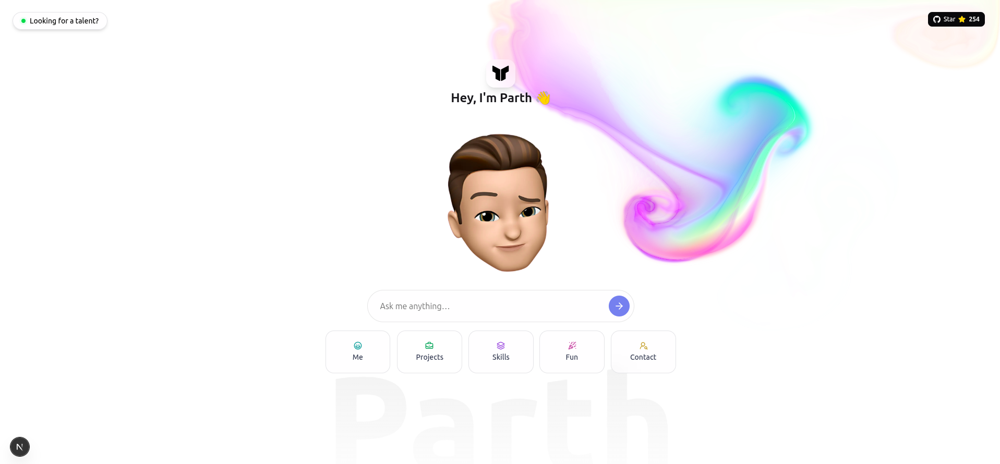

# AI-Powered Interactive Portfolio 🤖✨

**Static portfolios are outdated.**  
So I built an intelligent portfolio experience at [parth-portfolio-pc.vercel.app](https://parth-portfolio-pc.vercel.app).

Instead of making you scroll endlessly, my portfolio adapts to _you_.  
Ask a question — my AI assistant replies instantly with personalized information about my experience, projects, and skills.

## 👇 What can you ask?

- 🧠 **Recruiters?** Ask about my mobile & web development experience
- 💻 **Developers?** Dive into my React Native, Next.js projects & technical approach
- 🧑‍🤝‍🧑 **Colleagues & friends?** See what I've been building lately
- 🚀 **Potential clients?** Learn about my freelance services & availability

---

This is not just a portfolio.  
It's a **conversation tailored to your curiosity** about my 2.5+ years of full-stack development experience.

➡️ **Try it now:** [https://parth-portfolio-pc.vercel.app](https://parth-portfolio-pc.vercel.app)  
_What will you ask about my React Native and web development journey?_

## 🚀 How to run

Want to run this project locally? Here's what you need:

### Prerequisites

- **Node.js** (v18 or higher)
- **npm** or **yarn** package manager
- **OpenAI API token** (for AI chat functionality)

### Setup

1. **Clone the repository**

   ```bash
   git clone https://github.com/pc1605/parth-portfolio.git
   cd parth-portfolio
   ```

2. **Install dependencies**

   ```bash
   npm install
   # or
   yarn install
   ```

3. **Environment variables**
   Create a `.env.local` file in the root directory:

   ```env
   OPENAI_API_KEY=your_openai_api_key_here
   ```

4. **Run the development server**

   ```bash
   npm run dev
   # or
   yarn dev
   ```

5. **Open your browser**
   Navigate to `http://localhost:3000`

### Getting your **API Key**

- **OpenAI API Key**: Get it from [platform.openai.com](https://platform.openai.com/api-keys)

## 🛠️ Tech Stack

- **Frontend**: Next.js 14, React, TypeScript
- **Styling**: Tailwind CSS, shadcn/ui components
- **AI Integration**: Vercel AI SDK, OpenAI API
- **Animations**: Framer Motion
- **Deployment**: Vercel

## 👨‍💻 About Me

I'm Parth Chauhan, a Mobile & Full-Stack Developer with 2.5+ years of experience at Brilworks Software. I specialize in:

- **Mobile Development**: React Native, iOS & Android
- **Web Development**: React.js, Next.js, TypeScript
- **Backend**: Node.js, RESTful APIs
- **Tools & Technologies**: Git/GitHub, Figma, Unix/Linux

Currently exploring new opportunities in mobile and web development while working on exciting projects that blend AI with great UX.

## 🔗 Connect with me

- **Email**: parth1652001@gmail.com
- **LinkedIn**: [linkedin.com/in/parth-chauhan-pc](https://www.linkedin.com/in/parth-chauhan-pc/)
- **GitHub**: [github.com/pc1605](https://github.com/pc1605)

#### 🔖 Tags

`#ReactNative` `#NextJS` `#MobileDeveloper` `#FullStackDeveloper` `#AIPortfolio` `#WebDevelopment` `#TypeScript` `#ReactJS`
